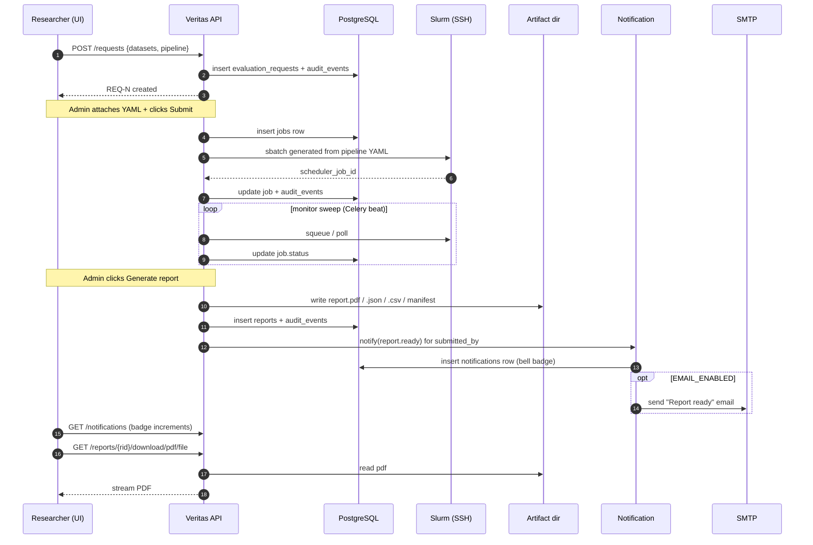
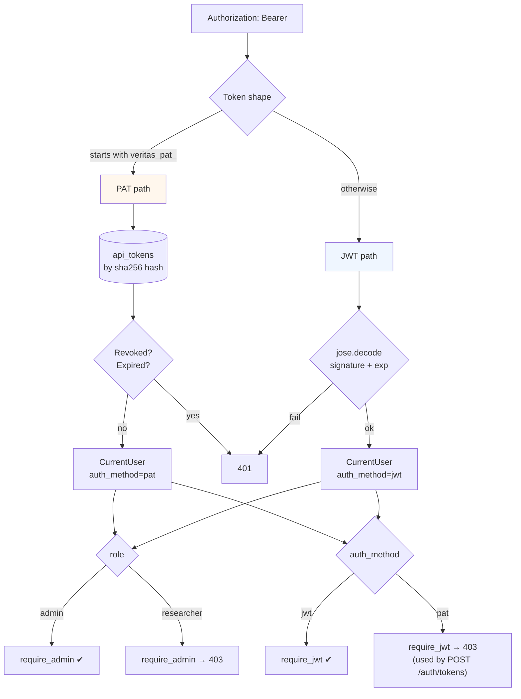

# Veritas + Atlas — system architecture

This is the canonical reference diagram for the platform. The Mermaid blocks
below render directly in GitHub. PDF / SVG exports for the paper live next
to this file (`veritas-architecture.svg`, generated by
`scripts/render-architecture.sh` when present).

---

## 1. High-level system view

```mermaid
flowchart LR
    subgraph "User browsers"
        R[Researcher]
        A[Admin]
        Ops[Ops / on-call]
    end

    subgraph "Veritas UI (Vite + React)"
        UI[VeritasProduct.jsx<br/>+ LoginGate]
    end

    subgraph "Veritas Platform API (FastAPI)"
        Auth["/auth + RBAC + PAT"]
        Req["/requests"]
        Job["/jobs<br/>preview · submit · advance · logs"]
        Rep["/reports<br/>generate · download"]
        LB["/leaderboard"]
        Notif["/notifications"]
        Admin["/admin<br/>users · audit · audit/export"]
        Pipe["/pipelines"]
        AuditMW{{"AuditMiddleware<br/>append-only audit_events"}}
        EmailSvc[[email_service<br/>best-effort SMTP]]
    end

    subgraph "Atlas Data API (FastAPI)"
        AtDS["/datasets"]
        AtStg["/staging"]
        AtGrant["/admin/grants"]
        AtPenn[[Pennsieve client]]
    end

    subgraph "Storage"
        PG[(PostgreSQL<br/>users, tokens, requests,<br/>jobs, reports, audit_events,<br/>notifications, leaderboard)]
        Artifacts[("Artifact root<br/>report.pdf / .json / .csv<br/>run_manifest.json")]
        Redis[(Redis<br/>Celery broker)]
    end

    subgraph "HPC (Slurm cluster)"
        SSH{Paramiko SSH}
        Sbatch[sbatch]
        Apptainer[Apptainer container]
        FS[FreeSurfer]
        MELD[MELD Graph]
    end

    subgraph "Observability"
        Prom["/metrics<br/>(Prometheus)"]
        Grafana[(Grafana dashboard<br/>veritas-overview.json)]
        Logs[("structured logs<br/>stdout → shipper")]
    end

    SMTP[[SMTP relay]]
    OIDC[[OIDC IDP<br/>scaffolded, not wired]]

    R --> UI
    A --> UI
    Ops --> Grafana

    UI -.JWT / PAT.-> Auth
    UI --> Req
    UI --> Job
    UI --> Rep
    UI --> LB
    UI --> Notif
    UI --> Admin
    UI --> Pipe

    Auth -.first admin via CLI or LoginGate.-> PG
    Req --> PG
    Job --> PG
    Rep --> PG
    LB --> PG
    Notif --> PG
    Admin --> PG
    Pipe --> PG

    Auth -. all state-changing writes .-> AuditMW
    Req -. .-> AuditMW
    Job -. .-> AuditMW
    Rep -. .-> AuditMW
    Admin -. .-> AuditMW
    AuditMW --> PG

    Job -- shared secret --> AtStg
    Req -- shared secret --> AtDS
    Pipe -- shared secret --> AtDS
    AtPenn -.optional.-> Penn[(Pennsieve)]
    AtDS --> PG2[(Atlas Postgres)]
    AtStg --> PG2
    AtGrant --> PG2

    Job -- Paramiko --> SSH
    SSH --> Sbatch
    Sbatch --> Apptainer
    Apptainer --> FS
    Apptainer --> MELD
    Apptainer -. predictions / metrics .-> Artifacts
    Rep --> Artifacts

    Rep -- notify --> Notif
    Notif --> EmailSvc
    EmailSvc --> SMTP

    Job -. enqueue .-> Redis
    Redis --> Celery[Celery worker<br/>+ beat]
    Celery -. monitor sweep .-> Job

    UI --> Prom
    Job --> Prom
    Prom --> Grafana
```

### Key decisions visible above

- **The `AuditMiddleware` wraps every state-changing endpoint.** All
  `POST/PUT/PATCH/DELETE` writes go through it; reads are deliberately not
  captured to keep volume manageable. The `audit_events` table is the
  single source of truth for "who did what."
- **PATs cannot mint PATs.** `POST /auth/tokens` requires `require_jwt`
  (not just any authenticated user). A leaked PAT can hit the API as the
  owning researcher but cannot escalate.
- **The first admin bootstraps via the UI or a CLI.** Self-registration
  always produces a researcher; the role is server-side enforced and
  audit-logged.
- **Email is best-effort.** A failed SMTP send never blocks the API
  response that triggered the notification — the in-app bell is the
  source of truth.
- **Atlas is a separate FastAPI app** with its own DB. Veritas talks to
  Atlas via a shared client secret. The two apps can be deployed together
  via `scripts/dev-stack.sh` or separately.
- **Slurm is reached over SSH (Paramiko).** No proprietary scheduler
  protocol; the API host needs SSH reachability to the cluster and a
  user with `sbatch` permissions.

---

## 2. Request flow: submit → run → report → notify



---

## 3. Auth hierarchy



---

## 4. Audit log lifecycle

```mermaid
flowchart LR
    W[Any state-changing<br/>POST/PUT/PATCH/DELETE] --> M[AuditMiddleware]
    M --> CTX{Extract actor +<br/>route + subject_id}
    CTX --> AE[(audit_events row)]
    AE --> A[GET /admin/audit]
    AE --> EX[GET /admin/audit/export<br/>?format=csv|json]
    AE --> R[scripts/audit_retention.sh<br/>monthly archive + prune]
    R --> Arc[("audit-YYYY-MM.csv.gz<br/>off-site")]
```

---

## File-level layout summary

```
.
├── atlas_api/atlas_api_app/          Atlas Data API (FastAPI on port 8000)
├── veritas/veritas_full_repo/
│   ├── backend/                      Veritas API (FastAPI on port 6000)
│   │   ├── app/
│   │   │   ├── api/routes/           HTTP routers (auth, jobs, reports, …)
│   │   │   ├── core/                 Settings, auth, audit, telemetry
│   │   │   ├── models/               SQLAlchemy ORM
│   │   │   ├── services/             AuthService, email, notifications, …
│   │   │   ├── workers/              Celery tasks (monitor sweep, …)
│   │   │   └── main.py               app + lifespan + middleware
│   │   ├── alembic/                  Migrations (0001 … 0017)
│   │   └── tests/                    pytest (126 cases)
│   └── frontend/                     React + Vite (port 7000)
│       ├── src/VeritasProduct.jsx    Single-component monolith (router-aware)
│       └── src/components/LoginGate.jsx
├── docs/
│   ├── architecture/                 This file
│   ├── grafana/veritas-overview.json
│   ├── VERITAS_PRODUCTION.md
│   ├── VERITAS_OPS_RUNBOOK.md
│   └── …
├── scripts/                          Ops: backup, audit_retention, dev-stack, loadtest
└── publication.md                    Where to publish + what to add first
```
